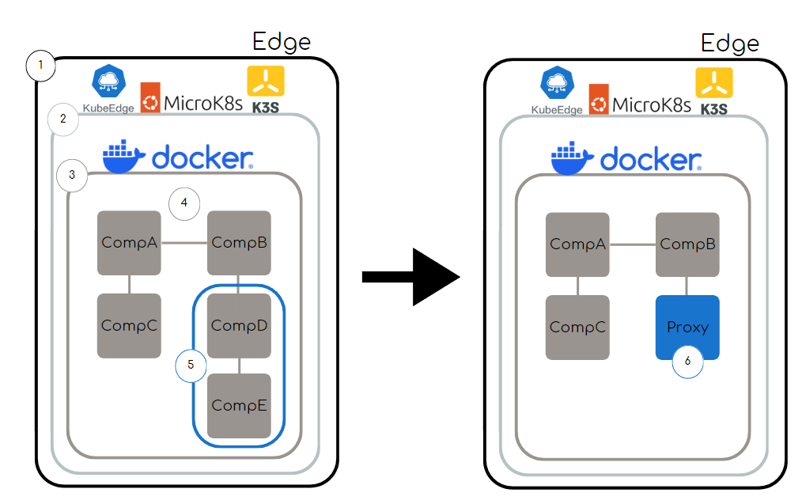
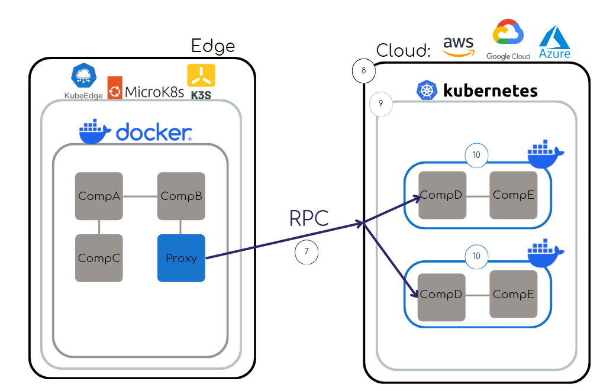

# Sistemas Auto-distribuídos: Instanciação Dinâmica de Componentes

## Introdução

Aplicações modernas, como Internet das Coisas (IoT), análise de dados, streaming de vídeo, realidade aumentada e realidade virtual, apresentam requisitos rigorosos de qualidade de serviço, especialmente em termos de tempo de resposta e throughput.

Essas demandas resultaram na necessidade de infraestruturas ricas em recursos computacionais, levando ao desenvolvimento do **Edge-Cloud Continuum**, uma abordagem que combina plataformas de computação em borda e nuvem para oferecer escalabilidade, flexibilidade e mobilidade. Essa combinação permite que aplicações sejam implementadas em toda a rede, otimizando a qualidade de serviço.

No entanto, muitas aplicações não conseguem explorar plenamente o potencial do Edge-Cloud Continuum devido à sua arquitetura monolítica e com estado. Os **Sistemas Auto-Distribuídos** surgem como uma alternativa para superar essa limitação. Eles permitem que aplicações monolíticas sejam replicadas ou movidas em infraestruturas distribuídas em tempo de execução, facilitando o dimensionamento horizontal e a implantação em ambientes híbridos de borda e nuvem.

Apesar de promissores, os Sistemas Auto-Distribuídos ainda não estão integrados a infraestruturas amplamente adotadas, como contêineres e orquestradores, sendo implantados de forma específica em nível de processos. Este projeto busca superar essas limitações, integrando Sistemas Auto-Distribuídos a contêineres e orquestradores amplamente utilizados, como Docker e Kubernetes.

---

## Descrição da Proposta

### Detalhamento da Solução Proposta

O trabalho desenvolvido neste projeto concentrou-se na integração inicial de Sistemas Auto-Distribuídos com contêineres Docker, utilizando uma abordagem baseada em instanciação dinâmica de componentes e comunicação via redes privadas Docker. A solução implementada tem os seguintes objetivos:

- **Encapsulamento de Componentes:** Criar uma imagem Docker base única, denominada `dana`, contendo todos os requisitos e configurações necessários para o programa. Essa imagem foi utilizada como base para instanciar os diferentes componentes do sistema, garantindo consistência e isolamento.
- **Instanciação Dinâmica:** Implementar um mecanismo para instanciar dinamicamente componentes durante a execução, evitando a necessidade de criar novos contêineres para cada instância. Essa abordagem otimiza os recursos e reduz o tempo de inicialização.

- **Automação do Gerenciamento:** Desenvolver uma API RESTful para automatizar a gestão de contêineres, permitindo criar, listar e remover instâncias conforme a demanda.

- **Comunicação em Rede Docker:** Configurar uma rede privada Docker para permitir a comunicação direta entre os componentes, eliminando a necessidade de expor portas ao ambiente externo.

Este trabalho foi uma etapa inicial, focada no uso de contêineres como meio para distribuir componentes de maneira dinâmica e eficiente. No futuro, pretende-se expandir essa solução para integrar completamente os Sistemas Auto-Distribuídos com plataformas de borda e nuvem, como Google Cloud e KubeEdge, possibilitando uma infraestrutura híbrida que abrange o Edge-Cloud Continuum.

---

## Principais Funcionalidades

As funcionalidades principais desenvolvidas neste projeto são:

- **Instanciação Dinâmica de Componentes:** Permitir que componentes sejam instanciados dinamicamente durante a execução, sem necessidade de recompilação, facilitando a escalabilidade do sistema.
- **Reaproveitamento de Contêineres:** Evitar a criação desnecessária de novos contêineres, reduzindo o tempo de inicialização e otimizando o uso de recursos.
- **Integração com Docker:** Contêinerização dos componentes usando uma imagem base única para garantir portabilidade e isolamento.
- **Comunicação em Rede Docker:** Configuração de uma rede privada Docker para facilitar a comunicação entre os componentes, dispensando a exposição de portas desnecessárias.
- **Gerenciamento de Contêineres com API:** Desenvolvimento de uma API para gerenciar a instanciação, remoção e listagem dos contêineres dinamicamente.

---

## Abordagem Utilizada para Implementação

A implementação deste projeto foi dividida em etapas específicas para atender os requisitos de integração com infraestrutura de borda e nuvem:

1. **Contêinerização com Docker:**

   - Foi criada uma imagem base, chamada `dana`, utilizando um Dockerfile que configura o ambiente e os requisitos do programa.
   - Os componentes do sistema foram instanciados dinamicamente usando essa imagem como base, garantindo consistência e reduzindo o tempo de build.

2. **Desenvolvimento de API para Gerenciamento:**

   - Uma API RESTful foi desenvolvida em Java/Spring Boot para gerenciar dinamicamente os contêineres do sistema.
   - Endpoints permitem instanciar, listar e remover contêineres, além de reaproveitar contêineres existentes para otimizar o uso de recursos.

3. **Instanciação Dinâmica:**

   - Os componentes podem ser instanciados passando comandos e nomes específicos, permitindo a flexibilidade para lidar com diferentes partes do sistema.
   - Essa abordagem possibilita escalabilidade dinâmica durante a execução, sem a necessidade de alterações no código fonte.

4. **Integração com Edge-Cloud:**

   - Apesar de ainda não concluída, a integração com Google Cloud e KubeEdge está nos planos futuros, visando a expansão da solução para ambientes distribuídos híbridos.

## Diagrama de Comunicação - Projeto Atual

### Composição Local

### Composição Distribuída

## Diagrama de Comunicacão - Projeto Futuro

Nesta seção, apresentaremos dois diagramas que ilustram o fluxo de dados e a comunicação entre os componentes do sistema em diferentes cenários de operação.

O primeiro diagrama foca na substituição de componentes por proxies dentro de uma aplicação que roda na borda (Edge). Ele demonstra como componentes individuais podem ser realocados dinamicamente, com a camada de proxies garantindo a continuidade do serviço e a transparência na comunicação entre os módulos.

O segundo diagrama expande essa visão ao representar os mesmos componentes distribuídos entre a borda e a nuvem (Cloud), mostrando a comunicação entre ambos os ambientes. Esse cenário destaca como os componentes da aplicação podem ser transferidos da borda para a nuvem, garantindo otimização e flexibilidade em termos de desempenho.

Embora a comunicação entre a borda e a nuvem seja o foco principal para fins de compreensão, o processo inverso – realocação de componentes da nuvem para a borda – também pode ocorrer. No entanto, utilizamos o cenário de borda para nuvem devido à sua maior simplicidade de entendimento para a presente explicação.

Após a apresentação de cada diagrama, explicaremos os pontos mais relevantes de sua estrutura, detalhando os elementos destacados e suas funções dentro do sistema.

Sobre cada um dos pontos numerados neste primeiro diagrama, podemos comentar o seguinte:

1. **Dispositivos de Borda (Edge):** Representa os diversos dispositivos de borda nos quais a aplicação pode estar em execução. A borda (Edge) é responsável por fornecer processamento local e imediato, reduzindo a latência e o uso de largura de banda ao evitar a necessidade de enviar todos os dados diretamente para a nuvem. Nesse cenário, a aplicação está rodando diretamente em um destes dispositivos, permitindo a realocação e substituição de componentes conforme necessário para otimizar o desempenho e a continuidade dos serviços.
2. **Orquestradores de Contêineres na Borda (KubeEdge, MicroK8s, K3s):** Estes são os orquestradores de contêineres que operam nos dispositivos de borda, responsáveis por gerenciar e coordenar a execução dos contêineres que compõem a aplicação distribuída. KubeEdge, MicroK8s e K3s são soluções otimizadas para ambientes de borda, garantindo a eficiência na execução de contêineres em dispositivos com recursos limitados.
3. **Container Docker:** Este representa o ambiente isolado onde a aplicação está em execução, encapsulando seus componentes e dependências. O Docker permite que a aplicação rode de forma consistente em qualquer infraestrutura, seja na borda ou na nuvem.
4. **Aplicação Baseada em Sistemas Auto-Distribuídos (Componentes A, B, C, D, E):** A aplicação em execução dentro do contêiner Docker é composta por diversos componentes distribuídos e realocados dinamicamente entre diferentes ambientes.
5. **Componentes Destinados à Realocação (Componentes D e E):** Os componentes D e E serão realocados para a nuvem, motivados por necessidade de maior capacidade computacional ou outras otimizações de desempenho.
6. **Proxy para Componentes Realocados:** Após a realocação dos componentes D e E para a nuvem, eles serão substituídos localmente por um proxy que atua como intermediário, garantindo a continuidade do funcionamento do sistema.

Sobre cada um dos pontos numerados neste segundo diagrama, podemos comentar o seguinte:

7. **Conexão RPC entre Proxy e Componentes Realocados:** Conexão remota via RPC (Remote Procedure Call) entre o proxy na borda e os componentes realocados na nuvem.
8. **Ambiente de Nuvem (AWS, Google Cloud, Azure):** Representa as plataformas de nuvem que oferecem a infraestrutura para hospedar e executar os componentes realocados.
9. **Orquestrador de Contêineres na Nuvem (Kubernetes):** Gerencia o ciclo de vida dos contêineres que hospedam os componentes realocados, facilitando escalabilidade e resiliência.
10. **Componentes Realocados dentro de Contêineres Docker e Replicados:** Componentes D e E, realocados para a nuvem, executam dentro de contêineres Docker e podem ser replicados para garantir resiliência e desempenho.

## Mais Detalhes

- <a href="/readmecontent/execute.md">Como executar o projeto</a>
- <a href="/readmecontent/api.md">Como funciona a API</a>
